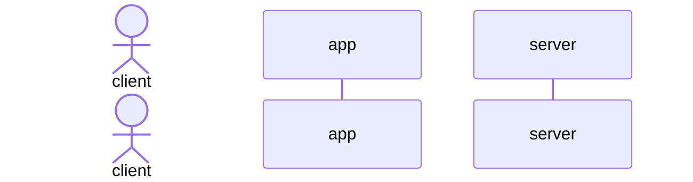
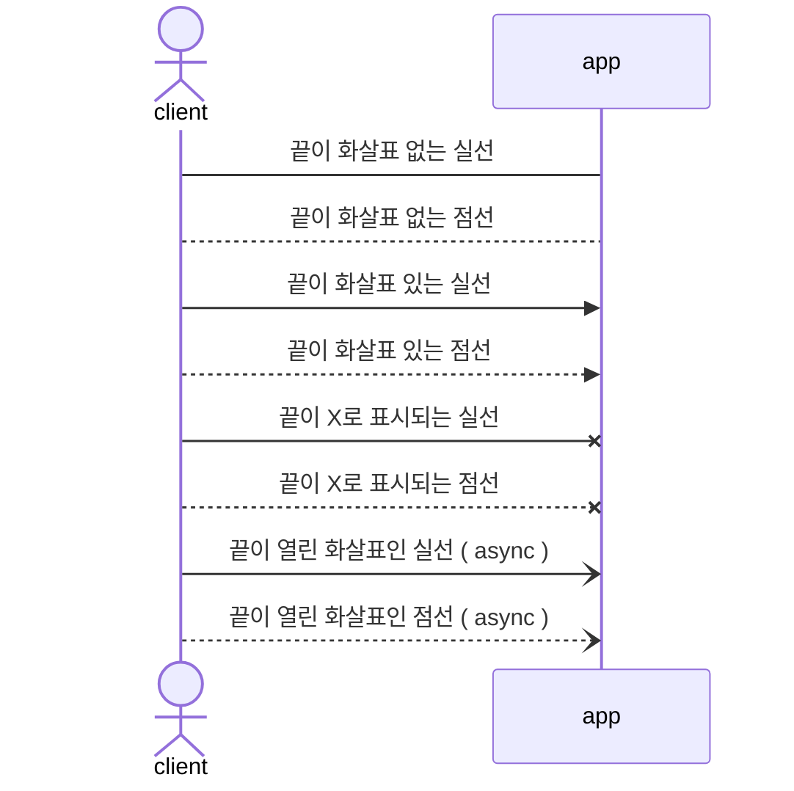

# Today I Learned
## Created : [[2022-06-02]]
## 내용
### 선언
최상단에 sequenceDiagram이 적혀야 시퀀스 다이어그램 선언이 가능하다.

### 다이어그램 구성 요소
#### Participant & Actor
- 시퀀스 다이어그램에 참여하는 시스템 또는 유저에 대해 participant 또는 actor 키워드로 다이어그램에 추가가 가능하다. participant는 네모박스로, actor는 사람의 형상으로 나타나고 alias를 통해 닉네임을 지어주는 것도 가능하다.
- 선언 순서의 변경으로 참여자의 위치 또한 변경할 수 있다.

```
sequenceDiagram 
	actor A as client 
	participant B as app 
	participant C as server
```


#### messages
두 참여자 사이의 상호작용을 나타낸다. mermaid에서는 실선과 점선을 제공한다. 그리고 끝 부분을 화살표, 아니면 선이 없을지 등도 표현할 수 있다.
```
sequenceDiagram 
	actor A as client 
	participant B as app
	 A->B: 끝이 화살표 없는 실선 
	 A-->B: 끝이 화살표 없는 점선 
	 A->>B: 끝이 화살표 있는 실선 
	 A-->>B: 끝이 화살표 있는 점선 
	 A-xB: 끝이 X로 표시되는 실선 
	 A--xB: 끝이 X로 표시되는 점선 
	 A-)B: 끝이 열린 화살표인 실선 ( async ) 
	 A--)B: 끝이 열린 화살표인 점선 ( async )
```



## ⏱히스토리
	- 2022-06-02 11:01 최초 작성


📙URL : [# [markdown] mermaid를 이용해서 UML 그리기 - 시퀀스 다이어그램](https://sabarada.tistory.com/210?category=800100)